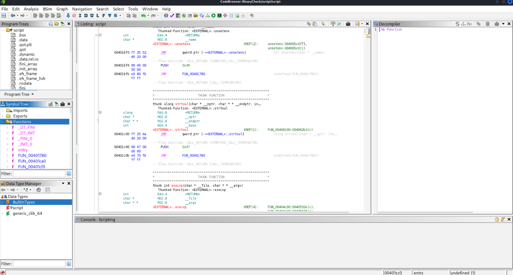
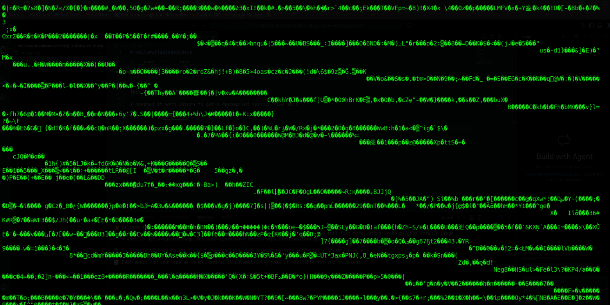

# HelloWorldBinaryCheck

I first created a simple python script that will print text and turn the user input into capital letter.

```python                                                                             
def main():
        print("Hello")
        text = input("Type some text: ")
        print(text.upper())


if __name__ == '__main__':
        main()

```

Then i compiled it using PyInstaller.

I openned it with Ghidra to get a decompiled version like this : 



If open with a text reader it look unreadable like this : 

